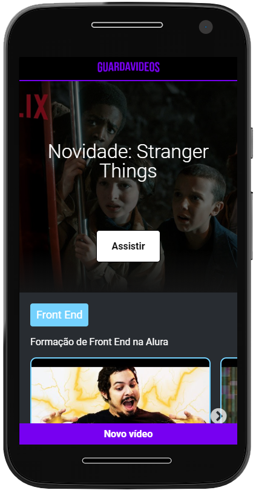
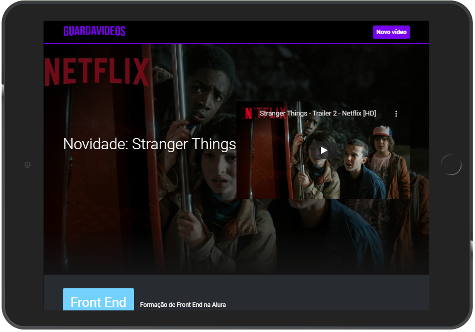

# Guardavídeos

Uma aplicação feita para salvar seus vídeos favoritos. :)<br />
Para isso, basta inserir o título do vídeo, o link para acessa-lo e definir a qual categoria ele pertence. <br />
É possível inserir novas categorias, para que mais vídeos possam ser divididos de uma melhor forma.

## Algumas das tecnologias utilizadas

+ [React](https://reactjs.org/)
+ [Styled-components](https://styled-components.com/)
+ [JSON Server](https://github.com/typicode/json-server)
+ [React Slick](https://react-slick.neostack.com/)

A aplicação foi hospedada no [Heroku](https://www.heroku.com/) e no [Vercel](https://vercel.com/). <br />
Podendo ser acessada [aqui](https://guardavideos.vercel.app/) ou [aqui](https://alura.ciromoura.com.br/).




## Instalação e uso

No diretório do projeto, execute:
```
yarn install
```
Instala todas dependências listadas no ``package.json`` em sua pasta local ``node_modules``.
```
yarn dev
```
Executa os dois comandos necessários para iniciar a api em ``localhost:8080`` e aplicação em ``localhost:30000``. <br /> 
Você pode observar outros comandos no arquivo ``package.json``.

<hr>

Elaborado durante a #ImersãoReact da [Alura](https://www.alura.com.br/). <br />
[Crie um aplicativo com React](https://github.com/facebook/create-react-app).

## [@CiroMoura](http://ciromoura.com.br)
